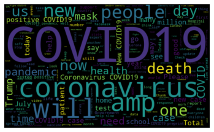
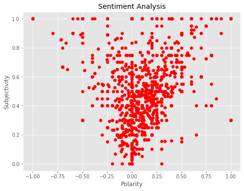
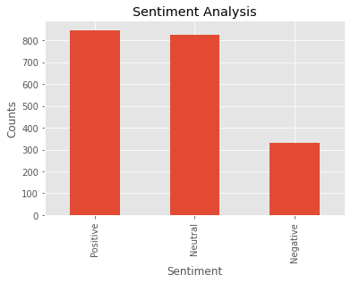

# Twitter Sentiment Analysis
A Python script that anaylses tweets and divides them into subgroups based on sentiment!!

## Basic Desc
The following app is a Twitter Sentiment Analysis Program. 

This program takes up a dataset of tweets (Till i get a twitter API). User enter the name of the dataset to be used and number of tweets to be analysed with max Limit given.
It then identifies the correct column for analysis based on modifiable list.

Cleaning step is processed over the data set to remove unwanted texts like @mentions,#tags,links and other garbage symbols using a function called cleanText().

It then calculates the subjectivity and polarity using the TextBlob library and then the respective scores the dataset as columns.

Next a wordCloud is generated using the worldCloud funtionality to highlight important and most frequently used words.

Then according to the polarity score tweets are subgrouped in positive, negative or neutral groups. And the classification is added to the dataset as a new column.

The program also provides the functionality to rerieve tweets based on their classification. Percentage distribution of the subgroups is also calculated.

Finally the plot is projected for the distribution of subgroups.

  

## Required Libraries
### tweepy
### textblob
### wordcloud
### pandas
### numpy
### re
### matplotlib

